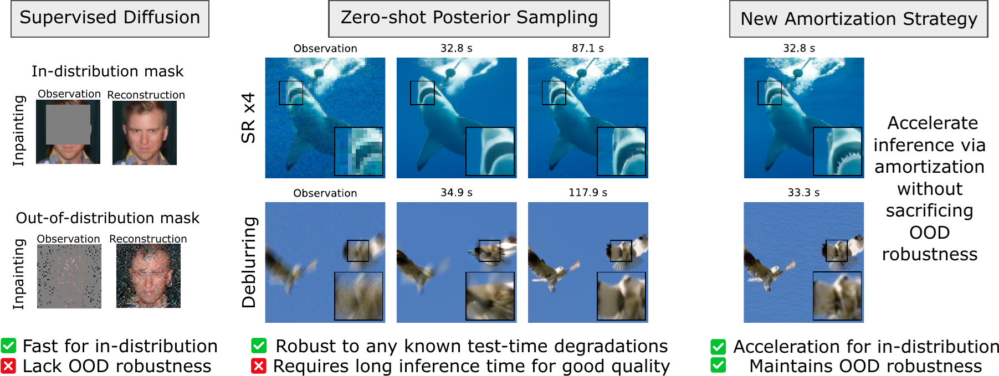

# LAVPS: Fast and Robust Likelihood-Guided Diffusion Posterior Sampling

[](https://arxiv.org/abs/2602.07102)



Welcome to the official repository for **LAVPS**. This codebase provides the implementation for the paper [*Fast and Robust Likelihood-Guided Diffusion Posterior Sampling with Amortized Variational Inference*](https://arxiv.org/abs/2602.07102).

LAVPS is a novel framework designed to tackle Bayesian inverse problems—such as motion deblurring, super-resolution, and inpainting—by acting as a highly efficient generative prior. While traditional zero-shot diffusion posterior sampling is flexible, it often suffers from slow, computationally expensive likelihood-guided updates. LAVPS solves this by introducing an amortization strategy that preserves explicit likelihood guidance while amortizing the inner optimization problems. 

The result is a dramatically accelerated inference process for in-distribution degradations that still maintains robustness when facing previously unseen operators at test time. This repository contains the code, configs, and scripts for LAVPS (including the **invfussion** architecture). Unconditional HDiT priors for FFHQ and ImageNet (256×256) are provided via GitHub Releases; LAVPS inference models are trained with the scripts in this repo.

## 1. Installation

The **invfussion** architecture **requires** `natten 0.17.5`. The provided `requirements.txt` is optimized for the combination of **Python 3.12**, **CUDA 12.4**, and **PyTorch 2.6**.
This code has been strictly tested using **Python 3.12** within a virtual environment managed by `pyenv`.

### Environment Setup

We recommend using `pyenv` to manage your Python versions and virtual environments. Please use an online guide to install a Python 3.12 environment for this project.

Then, activate your environment:
```bash
source .venv/bin/activate
```

### Install Dependencies

Once your environment is active, run the following command to install the required stack (including the specific NATTEN 0.17.5 pre-compiled wheel):

```bash
pip install --upgrade pip
pip install -r requirements.txt
pip install -e .
```

## 2. Setup the Data

You will need to download the training sets for both the FFHQ and ImageNet datasets. Then set the `path` field in each dataset config to your local directory (replace the `/path/to/...` placeholders):

* [`configs/dataset/ffhq.yaml`](configs/dataset/ffhq.yaml) — set `path: "/path/to/ffhq"`
* [`configs/dataset/imagenet.yaml`](configs/dataset/imagenet.yaml) — set `path: "/path/to/imagenet"`

The `ffhq_train` / `ffhq_val` / `ffhq_test` and `imagenet_*` configs inherit from these base files, so you only need to edit the two paths above.

## 3. Setup the models

### Pretrained Diffusion Models (unconditional HDiT)

We release the two unconditional HDiT priors used in the paper (FFHQ 256×256 and ImageNet 256×256) as GitHub Release assets. Because of GitHub’s file-size limit, each checkpoint is split into parts under 2 GiB.

1. Download all parts and `SHA256SUMS` from the [Releases](../../releases) page into one directory.
2. Reassemble and verify:

```bash
# from the directory containing the downloaded parts
bash assemble_checkpoints.sh
# or manually:
cat hdit-ffhq256-unconditional.pt.part-* > hdit-ffhq256-unconditional.pt
cat hdit-imagenet256-unconditional.pt.part-* > hdit-imagenet256-unconditional.pt
sha256sum -c SHA256SUMS
```

3. Point the model configs at the reassembled files (replace the placeholders):

* [`configs/model/hdit_ffhq.yaml`](configs/model/hdit_ffhq.yaml) — set `path: '/path/to/hdit-ffhq256-unconditional.pt'`
* [`configs/model/hdit_imagenet.yaml`](configs/model/hdit_imagenet.yaml) — set `path: '/path/to/hdit-imagenet256-unconditional.pt'`

### Inference Models for LAVPS

Amortized LAVPS inference models are **not** redistributed in this release. Train them with the scripts under `bash/` (e.g. motion deblurring on FFHQ, super-resolution on ImageNet) or:

```bash
python scripts/train_inference_model.py
```

After training, set `model_path` in the LAVPS multirun scripts (e.g. [`bash/ffhq/multirun_lavps_ffhq_mb.sh`](bash/ffhq/multirun_lavps_ffhq_mb.sh)) so it is passed to `sampler.parameters.initialize_va_cfg.path`.

## 4. Run the Algorithm

Once your models and data are configured, you can use the following scripts to evaluate the framework:
* Run `scripts/generate_images.py` to generate the restored images (zero-shot MGDM works with the unconditional priors alone; LAVPS needs a trained inference model).
* Run `scripts/compute_metrics.py` to compute the evaluation metrics and analyze the performance.

Example (zero-shot MGDM on FFHQ motion deblur):

```bash
bash bash/ffhq/inference_mgdm_ffhq_mb.sh
```

---

## Citation

If you find this work useful in your research, please consider citing:
```
@misc{zheng2026fast,
      title={Fast and Robust Likelihood-Guided Diffusion Posterior Sampling with Amortized Variational Inference}, 
      author={Zheng, L{\'e}on and Hirtz, Thomas and Janati, Yazid and Moulines, Eric},
      year={2026},
      eprint={2602.07102},
      archivePrefix={arXiv},
      primaryClass={cs.CV}
}
```
